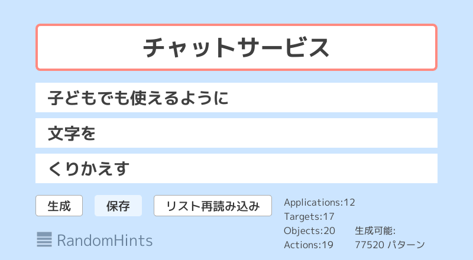

# RandomHints

作ってみたいアプリやサービスはあるけれど、オリジナリティのあるアイデアが思いつかないことはよくあります。
そんなときは乱数で発想のヒントを生成してみると、これまでの常識を打ち破るようなアイデアを生み出せるかもしれません。

## 準備

準備するのは 4 つのリスト（テキストファイル）です。

### applications.txt: 作ってみたいアプリケーションリスト
自分が作ってみたい、もしくは作れそうなアプリを列挙します。

### targets.txt: 目標リスト
達成すると良さそうなことを列挙します。アプリケーションのことはいったん忘れて、良さそうなイメージの文章を書いていきます。

### objects.txt: 着眼点リスト
実装を工夫する箇所を列挙します。自分の得意な技術を盛り込むとよいでしょう。

### actions.txt: アクションリスト
具体的な実装のアクションを列挙します。動詞で書きます。

## 使い方

- 「生成」: リストのアイテムをランダムに組み合わせて新しいアイデアのヒントを生成します。

- 「保存」: 画面のスクリーンショットを保存します。アプリケーションと同じフォルダに Save フォルダが作られます。

- 「リストを再読み込み」: リストをテキストエディタなどで変更した場合に、再読み込みします。

## ソースコード
https://github.com/Reputeless/RandomHints

## 参考
- アイデアカード https://www.ideacard.jp/
